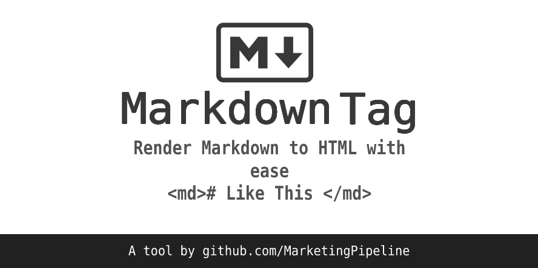

# Markdown-Tag

 
<p align="center">
  
</p>
                                                                     


   <p align="center">
    The easiest way to add Markdown support to your website!
  
  <br>
  <small> <b><i>Show your support!</i> </b></small>
  <br>
   <a href="https://github.com/MarketingPipeline/Markdown-Tag">
    
  </a>
  <a href="https://github.com/MarketingPipeline/Markdown-Tag/fork">
    
  </a>
   </p>  


## Example and usage

You can view a demo of Markdown Tag in use [here.](https://marketingpipeline.github.io/Markdown-Tag)


How to use <b><i>Markdown Tag</b></i>:

 To render Markdown to HTML simply use a md tag  - example below

            <md>
    # Markdown Support
               
               Awesomeness
             </md>

<b><i>or</i></b> add a md attribute to a HTML element - example below

            <div md>
    # Markdown Support
               
               Awesomeness
             </div>


   include this [script](https://github.com/MarketingPipeline/Markdown-Tag/blob/main/src/markdown-tag.js) in your HTML document.
         
    <script src="https://cdn.jsdelivr.net/gh/MarketingPipeline/Markdown-Tag/dist/markdown-tag.min.js" defer></script> 


<br>

How to render a <b>File</b> inside a <b><i>Markdown Tag</b></i>:

You can render file content from a URL or path to file by adding a <code>src</code> attribute like so -

       <md src="https://raw.githubusercontent.com/MarketingPipeline/Markdown-Tag/main/README.md">
       </md>  


<br>
         

How to use <b><i>Markdown Tag</b></i> with <b>GitHub Styling</b>:

Instead of using a <code>md</code> tag or attribute use <code>github-md</code>


<br>


How to <b>render</b> new Markdown content added to HTML:

Call this function using a onclick etc..

```
renderMarkdown();
```


<br>

How to prevent <b>Flash of Unstyled Content</b>:

<b><i>Markdowb Tag</i></b> adds a <code>md-rendered</code> attribute after the element(s) content(s) has been rendered to HTML. This allows you to style / hide unrendered content until it is rendered however you please (via JavaScript page loader, CSS or etc), here is a basic example of hiding un-rendered content using a <code>:not()</code> CSS selector.

```css
github-md:not([md-rendered]) { display: none }
```

## Syntax


  This script uses Showdown to render Markdown - to read about the Showdown's Markdown syntax style click [here](https://github.com/showdownjs/showdown/wiki/Showdown's-Markdown-syntax)

How to use <b><i>CommonMark Syntax</b></i>:

 If you wish to use [CommonMark](https://spec.commonmark.org/current/) syntax instead of Showdown's use this [script](https://github.com/MarketingPipeline/Markdown-Tag/blob/main/src/markdown-tag-commonmark.js) instead of the one above at the <b>bottom</b> of your HTML document.
         
    <script src="https://cdn.jsdelivr.net/gh/MarketingPipeline/Markdown-Tag/dist/markdown-tag-commonmark.min.js"></script> 

How to use <b><i>GitHub Flavored Markdown Syntax</b></i>:
 
 If you wish to use [GitHub Flavored Markdown Spec](https://github.github.com/gfm/) syntax  use this [script](https://github.com/MarketingPipeline/Markdown-Tag/blob/main/src/markdown-tag-Github.js) instead of the other script's above at the <b>bottom</b> of your HTML document. 
 
         
       <script src="https://cdn.jsdelivr.net/gh/MarketingPipeline/Markdown-Tag/dist/markdown-tag-GitHub.min.js"></script> 
      
 
  <i>Note:</i> This options includes - Tables, GitHub Mentions & More.             


## Syntax Highlighting 

> Note: to use Syntax Highlighting - you must use the GitHub flavored version of <b><i>Markdown Tag</i></b>.

By **default** using a <code>github-md</code> tag or attribute will automatically add a CSS style sheet for GitHub like syntax highlighting colors. 

To use Syntax Highlighting with a md tag or attribute, you will need to apply a CSS style sheet. You can find a list of Syntax Hightlighting style sheets that work with <b><i>Markdown Tag</i></b> [here](https://github.com/PrismJS/prism-themes)


## Handling untrusted content

By default, <b><i>Markdown Tag</i></b> does not sanitize the content you provide, since in most use cases the content is trusted.

Any other content provided from user's on your website etc. Should be sanitized before adding it to prevent XSS. 


## Contributing 

Want to improve this? Create a pull request with detailed changes / improvements! If approved you will be added to the list of contributors of this awesome project!


Looking for a task to work on? Check the tasks that need improved in the [to-do](https://github.com/MarketingPipeline/Markdown-Tag/blob/main/.github/to-do.md) list.


See also the list of
[contributors](https://github.com/MarketingPipeline/Markdown-Tag/graphs/contributors) who
participate in this project.

## License 

This project is licensed under the GPL-3.0 License - see the
[LICENSE.md](https://github.com/MarketingPipeline/Markdown-Tag/blob/main/LICENSE) file for
details.
